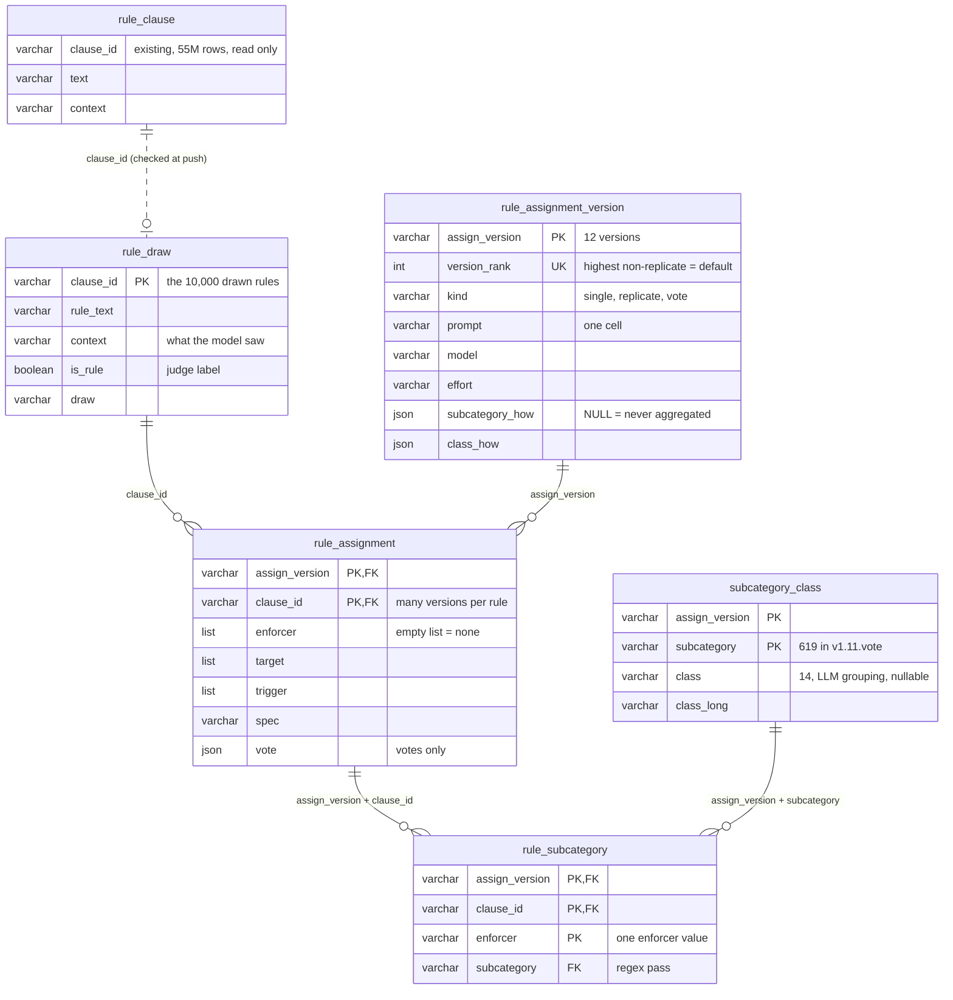

# rules in the wild

Natural-language rules from agent instruction files (`CLAUDE.md`, `AGENTS.md`, `.cursorrules`, …) → what could enforce each rule.

```
rule files ─► clause extraction ─► is_rule filter ─► assign ×3 ─► majority-vote judge ─► subcategory
              rule clause           sem_filter/       └──────────────── assign+group/ ───────────────┘
              extraction/
```

| folder | what it does |
|---|---|
| [`rule clause extraction/`](rule%20clause%20extraction/) | cuts rule files into clauses (a markdown parser, no LLM) |
| [`sem_filter/`](sem_filter/) | an LLM judge labels each clause: is it a rule? |
| [`assign+group/`](assign+group/) | **the pipeline**: for each rule, an LLM assigns `enforcer / target / trigger / spec` three times, a judge reconciles the three, and regex aliases group the enforcers into subcategories |

## Run the pipeline
```bash
git clone https://github.com/Andwwy/rules-in-the-wild.git && cd rules-in-the-wild/assign+group
pip install -e .
cp ../.env.example .env                  # fill in PERPLEXITY_API_KEY
python -m rule_pipeline.run examples/rules.sample.json --out runs/first --dry-run    # counts requests, calls nothing
python -m rule_pipeline.run examples/rules.sample.json --out runs/first
```
* **Input**: a JSON list of rules (`clause_id`, `rule_text`, `context`) — or `--from-db` to pull them from MotherDuck with `MOTHERDUCK_TOKEN`.
* **Output**: `runs/first/result.json`, one record per rule. Rerunning the same command resumes where it stopped.
* Stages can run separately (`--stages assign`, `vote`, `subcategory`); threads and batch size are flags (defaults 20 and 1).
* Everything else — settings, prompts, adding a model provider, tests — is in [`assign+group/README.md`](assign+group/README.md).

## Keys
Copy [`.env.example`](.env.example) to `.env` in the folder you run from: `PERPLEXITY_API_KEY` (the model provider),
`MOTHERDUCK_TOKEN` (the database), `GH_TOKEN` (GitHub API). Never commit a `.env`; they are git-ignored.

## Database
Results are stored in the MotherDuck database `rules`. A rule is a `rule_clause` row; it has many assignments, one per version,
and each version keeps the prompt that produced it.



Solid lines are foreign keys; the dashed link is checked at load time. Query through the views `rule_assignment_current` (the
newest assignment of each rule) and `rule_enforcer_current` (one row per enforcer, with its subcategory and class).
