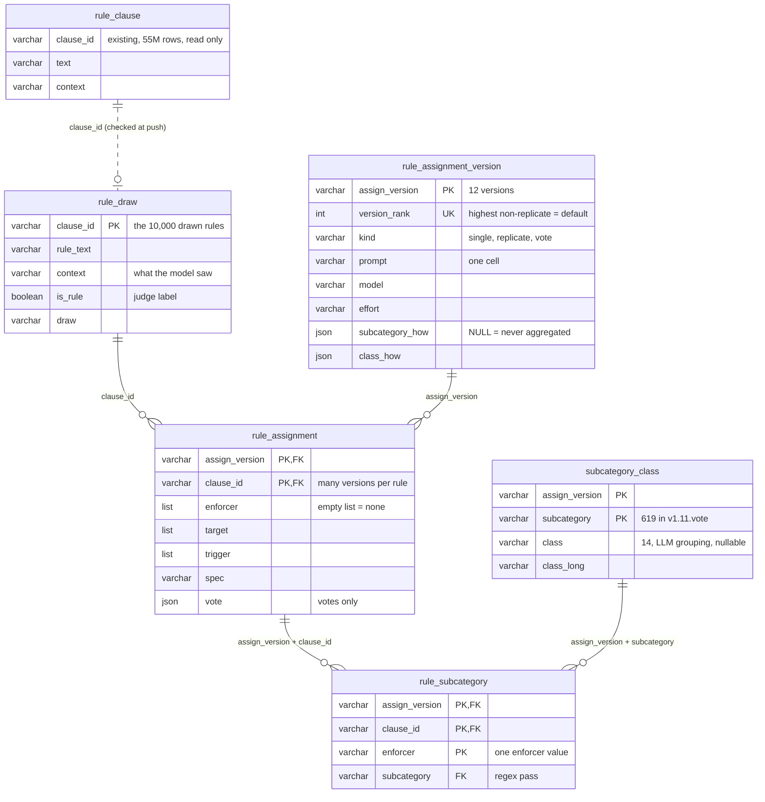

# rules in the wild

Natural-language rules mined from agent instruction files (`CLAUDE.md`, `AGENTS.md`, `.cursorrules`, …): collect them, cut them
into clauses, keep the ones that are rules, work out what could enforce each rule, and evaluate that enforcement.

```
crawl ──► clause extraction ──► is_rule filter ──► assign → vote → categorize ──► enforcement eval
archive/     rule clause           sem_filter/          assign+group/                 enforcement eval/
rule crawling/  extraction/                             (= the rule-pipeline repo)    enforcement eval test/
```

| stage | folder | what it holds | where its output lives |
|---|---|---|---|
| 1 crawl | `archive/rule crawling/` (finished Jul 2026) | the GitHub crawler for rule files | MotherDuck `rules.rule_file` — 2,204,470 files |
| 2 clause extraction | `rule clause extraction/` | the parser that cuts files into clauses, its audit, the bulk loader | MotherDuck `rules.rule_clause` — 55,182,794 clauses; Hugging Face dataset |
| 3 is_rule filter | `sem_filter/` | the judge prompt, the 30k judged sample, labelled control sets, the annotator | `sem_filter/data/30k filter result.json` → the 10k draw in `assign+group/data/` |
| 4 assign → vote → categorize | `assign+group/` | **`rule-pipeline`**, the shareable git repo: three prompted stages in six small modules. Past runs are local-only under its `archive/` and `data/` | MotherDuck `rule_assignment*`, `rule_subcategory`, `subcategory_class` (loader: `assign+group/motherduck upload/`) |
| 5 enforcement eval — **local only** | `enforcement eval/` | related work (≈160 entries), datasets per enforcer class, the proposed end-to-end eval design | — |
| — **local only** | `enforcement eval test/` | the local pilot: 10 rules per enforcer category, two tracks, scored on execution (`REPORT.md`) | — |

Every active folder has its own README; start there. Folder names are kept stable on purpose — Claude Code sessions and a few
scripts are keyed to these paths.

## The database
Results live in the MotherDuck database `rules`, next to the crawled files (`rule_file`) and the clauses (`rule_clause`). A rule
is a `rule_clause` row; it has **many** assignments, one per version, and each version carries its own prompt.



* Solid lines are declared foreign keys. The dashed one is checked at load time instead: `rule_clause` has no primary key to point
  at (an index over 55M rows does not fit the instance).
* `rule_subcategory` is the deterministic regex grouping (enforcer value → subcategory); `subcategory_class` is the optional LLM
  grouping (subcategory → class). Most rules have neither — only rules with a voted enforcer, target and trigger are grouped.
* Query through the views: `rule_assignment_current` (one row per rule — its newest version that is not a replicate),
  `rule_enforcer` and `rule_enforcer_current` (one row per enforcer value, with subcategory and class).

## Keys and environments
* `.env.example` at the root is the template: Perplexity key, MotherDuck token, GitHub token. Copy it to `.env` in the stage you run.
* Secrets live in per-project `.env` files that are never committed: `sem_filter/.env` (Perplexity),
  `rule clause extraction/.env` (MotherDuck, Hugging Face), `assign+group/.env` (copy `.env.example`).
* Perplexity's agent API is the group's default model provider (`openai/gpt-5.6-terra`, `flex`).
* `.venv-jupyter/` is the shared notebook environment; do not move it (virtualenvs hard-code their path).
